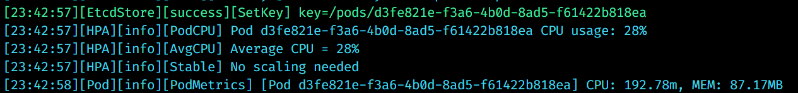

# Kubernetes Simulation in Go

A lightweight simulation of Kubernetes pods, nodes, and API server behavior built entirely in Go. Designed for learning Kubernetes internals, or experimenting with schedulers and autoscalers (HPA).

---

## Table of Contents

- [Project Goals](#project-goals)
- [Architecture Overview](#architecture-overview)
- [Components](#components)
- [Getting Started](#getting-started)
- [API Endpoints](#api-endpoints)
---

# Project Goals

This project simulates a simplified version of the Kubernetes control plane to help understand:
- How pods are created and run
- How state is stored and queried
- What an API server does
- How a scheduler and autoscaler might be plugged in
- How monitoring and logs are collected

It **does not run real containers**, but mimics resource usage (CPU/memory) and lifecycle changes.


---
## Checks if scaling is needed

---

## Addition of a new pod when CPU usage exceeds threshold


---

## Architecture Overview

```text
+-------------------------+
|     Gin HTTP Server     | ← Accepts REST API requests (simulate `kubectl`)
+-----------+-------------+
            |
            v
+-------------------------+
|        KubeAPI          | ← Core logic for creating/deleting/listing pods
+-----------+-------------+
            |
            v
+-------------------------+
|       EtcdStore         | ← In-memory key-value store (mimics etcd)
+-----------+-------------+
            |
            v
+-------------------------+
|      Pod Goroutines     | ← Simulated pods emitting logs & resource usage
+-------------------------+
```

Each **pod** is simulated using a **Go goroutine**, and each metric update is logged and persisted.

---

## Components

###  1. `KubeAPI`
Handles all pod operations:
- `CreatePod(name)` – assigns ID, persists to etcd, starts the goroutine
- `DeletePod(id)` – stops goroutine, removes from store
- `ListPods()` – fetches all active pods
- `GetPod(id)` – retrieves a specific pod

---

### 2. `EtcdStore`
An in-memory simulation of `etcd`:
- Key-value store with JSON-encoded data
- Thread-safe using mutexes
- Supports `Set`, `Get`, `Delete`, and `List(prefix)`

---

### 3. `Pod` Goroutines
Each pod behaves like this:
- Starts in `Pending`, then moves to `Running`
- Every second, updates fake CPU (100-200m) and Memory (50–100MB)
- Emits logs and stores state back to `EtcdStore`
- Stops gracefully and moves to `Succeeded` when `stopChan` is closed

---

### 4. `Analytics`
Every lifecycle event or metric is logged with:
- Component name
- Log level (`info`, `warn`, `error`, etc.)
- Action tag (e.g. `PodStart`, `GetKey`)
- Human-readable message

Helps trace what the simulated system is doing at runtime.

---

## 🚀 Getting Started

###  Install

```bash
git clone https://github.com/Prayag2003/kubernetes-simulation
cd kubernetes-simulation
go mod tidy
```

### ▶️ Run the API Server

```bash
go run cmd/main.go
```

You should see logs like:

```
[INFO] EtcdStore: Initialized in-memory etcd-style store.
[INFO] KubeAPI: CreatedPod: ID=..., Name=auto-pod-0
[INFO] Pod: PodStart: Pod ... starting ...
```

---

## API Endpoints
---

### 📦 Pod Endpoints

> Prefix: `/api/pods`

#### ✅ `GET /api/pods`

**Description:**
List all running, pending, or completed pods.

**Response Example:**

```json
[
  {
    "id": "123e4567",
    "name": "my-first-pod",
    "status": "Running",
    "cpu": 134,
    "memory": 76,
    "logs": ["[tick] Pod is running..."]
  }
]
```

---

#### ✅ `GET /api/pods/:id`

**Description:**
Get details about a specific pod by its ID.

**Response (200):**

```json
{
  "id": "123e4567",
  "name": "my-first-pod",
  "status": "Running",
  "cpu": 134,
  "memory": 76,
  "logs": ["[tick] Pod is running..."]
}
```

**Response (404):**

```json
{ "error": "Pod not found" }
```

---

#### ✅ `POST /api/pods`

**Description:**
Create a new pod with a given name.

**Request Body:**

```json
{
  "name": "my-new-pod"
}
```

**Response (201):**

```json
{
  "message": "Pod created",
  "id": "456e7890"
}
```

**Response (400):**

```json
{ "error": "Invalid pod name" }
```

---

#### ✅ `DELETE /api/pods/:id`

**Description:**
Delete a pod by its ID. This will stop the goroutine and clean it from the store.

**Response:**

```json
{ "message": "Pod deleted" }
```

---

### ⚖️ Horizontal Pod Autoscaler (HPA) Endpoints

> Prefix: `/api/hpa/config`

#### ✅ `GET /api/hpa/config`

**Description:**
Fetch the current HPA configuration.

**Response:**

```json
{
  "target_cpu": 70,
  "min_pods": 1,
  "max_pods": 10,
  "interval": "5s"
}
```

---

#### ✅ `POST /api/hpa/config`

**Description:**
Update the HPA configuration dynamically at runtime.

**Request Body:**

```json
{
  "target_cpu": 75,
  "min_pods": 2,
  "max_pods": 15,
  "interval": "10s"
}
```

**Response:**

```json
{
  "message": "HPA config updated",
  "config": {
    "target_cpu": 75,
    "min_pods": 2,
    "max_pods": 15,
    "interval": "10s"
  }
}
```

**Response (400):**

```json
{ "error": "Invalid interval format" }
```

---

### 🖥️ Node Endpoints (Placeholder)

> Prefix: `/api/nodes`

#### ✅ `GET /api/nodes`

**Note:**
Currently returns the same as `ListPods()` — a placeholder until actual node logic is added.

**Response:**

```json
[
  {
    "id": "pod-id-123",
    "name": "my-node-pod",
    "status": "Running",
    ...
  }
]
```
